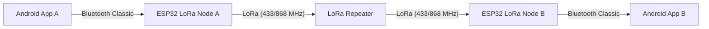

# Mesh-Messenger

**Децентрализованная система тактической связи (Off-Grid Communication System).**

Mesh-Messenger — это аппаратно-программный комплекс, позволяющий обмениваться текстовыми сообщениями на больших расстояниях без использования сотовой связи, интернета или централизованных серверов. Система использует смартфон в качестве терминала и модули ESP32+LoRa в качестве модемов и ретрансляторов.

---

## Цели проекта
* Обеспечение связи в условиях отсутствия инфраструктуры (походы, ЧС, перегрузка сетей).
* Создание масштабируемой Mesh-сети с автоматической ретрансляцией пакетов.
* Реализация надежного протокола доставки с подтверждением (ACK).

---

## Архитектура системы

Система работает по гибридной схеме **Bluetooth-to-LoRa Gateway**:

Пользователь пишет сообщение в Android-приложении.

Данные передаются на Узел связи (Node) по Bluetooth.

Микроконтроллер ESP32 упаковывает данные и отправляет их в эфир через радиомодуль LoRa.

Ретранслятор (промежуточный узел) принимает слабый сигнал и передает его дальше.

Узел получателя принимает радиопакет, проверяет целостность и передает текст на смартфон адресата.

Поддерживается система ACK (подтверждений) для гарантии доставки.

---

## Android Application (Software)
Клиентская часть, написанная на Kotlin.

Основные возможности:
Bluetooth Scanner: Поиск и подключение к модемам ESP32.

Tactical UI: Интерфейс в темных тонах для снижения визуальной заметности и экономии заряда.

Smart Persistence: Локальная база данных Room (история чатов сохраняется).

Delivery Status: Индикация статуса доставки ("Часики" -> "Галочка") при получении подтверждения (ACK) от удаленного узла через LoRa-сеть.

Стек технологий:
Language: `Kotlin`

Architecture: `MVVM`

Database: `Room (SQLite)`

Concurrency: `Coroutines & Flow`

Connectivity: `Android Bluetooth Classic API`

## Hardware (Embedded)

Аппаратная часть представляет собой автономный комплекс на базе микроконтроллеров Espressif и технологии дальней радиосвязи.

### Компоненты:
* **MCU:** ESP32 (ESP32-WROOM-32).
* **Radio:** Трансиверы LoRa SX1278 (433 MHz) или SX1276 (868 MHz) — обеспечивают связь вне прямой видимости.
* **Power:** Кастомная система питания на базе **Li-Ion аккумулятора (формат 18650)** с контроллером заряда (TP4056).

### Преимущества конфигурации LoRa:
* **Long Range:** Рабочая дистанция измеряется километрами ...
* **Penetration:** Радиосигнал на частотах 433/868 МГц значительно лучше проходит сквозь препятствия (стены, лес).
* **Autonomy:** Использование емких аккумуляторов 18650 в сочетании с низким потреблением LoRa обеспечивает длительную автономную работу узлов и ретрансляторов.

---

### Скриншоты
|Поиск устройств: | Чат: |
 

---

### Как запустить
1. Android
* Клонировать репозиторий.
* Открыть проект в Android Studio.
* Скомпилировать APK и установить на телефон.

2. ESP32 (Firmware)
(Код прошивки находится в папке /firmware)
* Установить Arduino IDE.
* Установить библиотеки BluetoothSerial и LoRa (Sandeep Mistry).
* Настроить частоту (433E6 или 868E6) в зависимости от региона.
* Прошить устройства.

---

### Команда разработчиков (Team)

* **[Даниил Светашов]** — **Team Lead & Software Engineer & Embedded Engineer**
    * Проектирование общей архитектуры системы (Android <-> ESP32 <-> LoRa).
    * Разработка мобильного приложения (Kotlin, MVVM).
    * Реализация работы с Bluetooth API и локальной базой данных Room.
    * UI/UX дизайн интерфейса терминала.
    * Написание прошивки для микроконтроллеров ESP32 (C++).

* **[Андрей Кондрацкий]** — **Hardware Engineer**
    * Подбор оптимальной электронной компонентной базы (BOM) и радиомодулей.
    * Монтаж печатных плат, пайка компонентов и физическая сборка прототипов устройства.
    * Проведение комплексных полевых испытаний и отладка (Debugging) системы в сборе.
    * Координация взаимодействия между разработчиками программной и аппаратной частей.

* **[Сергей Кирин]** — **Embedded Engineer**
    * Написание прошивки для микроконтроллеров ESP32 (C++).
    * Реализация драйверов LoRa (SX1278) и управления питанием.
    * Программная реализация алгоритмов ретрансляции и ACK.

* **[Егор Гавриленко]** — **Industrial Designer & Circuit Designer**
    * Разработка принципиальной схемы устройства.
    * Разработка эргономичного дизайна корпуса и 3D-моделирование (CAD).
    * Интеграция электронных компонентов, антенн и аккумулятора 18650 во внутренний объем.
    * Подготовка моделей к аддитивному производству (3D-печать) и финальная сборка устройства.

* **[Александр Алексеев]** — **QA Engineer & Technical Writer**
    * Написание технической документации (ТЗ, Руководство пользователя).
    * Подготовка отчетности и анализ ошибок (Bug tracking).
    * Проведение комплексных полевых испытаний и отладка (Debugging) системы в сборе.

---

### Лицензия
Этот проект распространяется под лицензией **MIT License**.
Подробности см. в файле [LICENSE](LICENSE).

