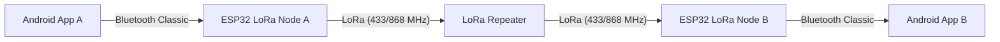

# Mesh-Messenger

**Децентрализованная система тактической связи (Off-Grid Communication System).**

MeshMessenger — это аппаратно-программный комплекс, позволяющий обмениваться текстовыми сообщениями на больших расстояниях без использования сотовой связи, интернета или централизованных серверов. Система использует смартфон в качестве терминала и модули ESP32+LoRa в качестве модемов и ретрансляторов.

---

## Цели проекта
* Обеспечение связи в условиях отсутствия инфраструктуры (походы, ЧС, перегрузка сетей).
* Создание масштабируемой Mesh-сети с автоматической ретрансляцией пакетов.
* Реализация надежного протокола доставки с подтверждением (ACK).

---

## Архитектура системы

Система работает по гибридной схеме **Bluetooth-to-LoRa Gateway**:

Пользователь пишет сообщение в Android-приложении.

Данные передаются на Узел связи (Node) по Bluetooth.

Микроконтроллер ESP32 упаковывает данные и отправляет их в эфир через радиомодуль LoRa.

Ретранслятор (промежуточный узел) принимает слабый сигнал и передает его дальше.

Узел получателя принимает радиопакет, проверяет целостность и передает текст на смартфон адресата.

Поддерживается система ACK (подтверждений) для гарантии доставки.

---

## Android Application (Software)
Клиентская часть, написанная на Kotlin.

Основные возможности:
Bluetooth Scanner: Поиск и подключение к модемам ESP32.

Tactical UI: Интерфейс в темных тонах для снижения визуальной заметности и экономии заряда.

Smart Persistence: Локальная база данных Room (история чатов сохраняется).

Delivery Status: Индикация статуса доставки ("Часики" -> "Галочка") при получении подтверждения (ACK) от удаленного узла через LoRa-сеть.

Стек технологий:
Language: `Kotlin`

Architecture: `MVVM`

Database: `Room (SQLite)`

Concurrency: `Coroutines & Flow`

Connectivity: `Android Bluetooth Classic API`
